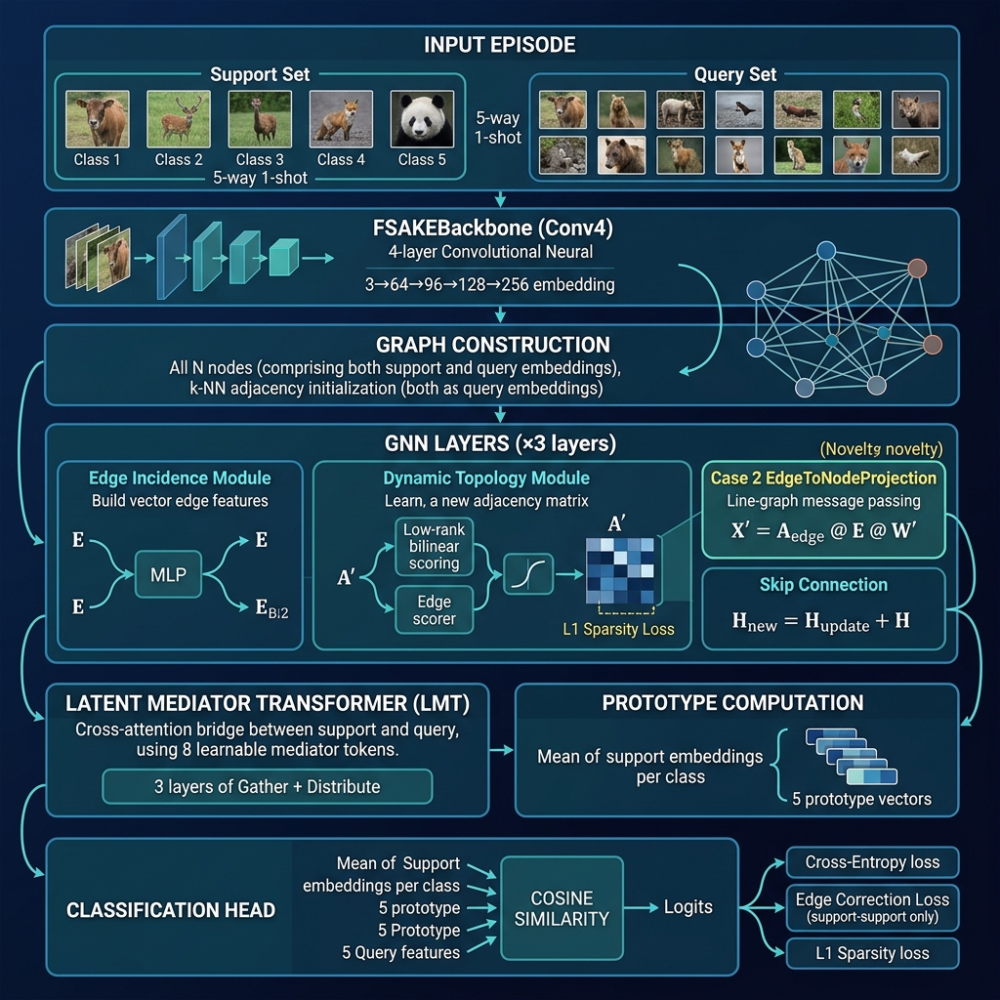

# DEKAE: Dynamic Edge-driven Topology for Episodic Few-Shot Learning

> **Paper identity**: *A topology-learning framework with explicit structural regularization and supervised relational recovery for episodic few-shot learning.*
>
> Extension of FSAKE with Supervised Relational Recovery — introducing vector-valued edge features, dynamic graph topology, and a Latent Mediator Transformer into the few-shot episodic learning pipeline.

---

## High-Level Overview

### What Problem Is Being Solved?

Few-shot learning (FSL) asks: *given only a handful of labeled examples per class, can a model recognize new classes?* The standard episodic protocol draws **N-way K-shot episodes** — N classes, K labeled support examples each, and a query set to classify.

Most FSL methods either:
- Compute fixed similarity metrics between query and support prototypes (PrototypicalNetworks), or
- Use a GNN to pass messages over the support+query graph — but these GNNs use **static** adjacency (HGNN) or **scalar** per-edge weights (FSAKE).

**DEKAE's key claim**: Using *vector-valued* edge features and *supervised topology recovery* enables richer relational reasoning that scalar-weight GNNs cannot represent.

---

## Architecture Overview



```
Input Episode
│
├── Support Set: N_way × K_shot images   (5 labeled, 5-way 1-shot)
└── Query Set:   N_way × N_query images  (15 unlabeled)
          │
          ▼
┌─────────────────────────────────────┐
│  FSAKEBackbone (Conv4)              │  ← shared backbone, identical to FSAKE
│  3→64→96→128→256→128-dim           │    for fair comparison
│  4 conv blocks + BN + LeakyReLU    │
│  Output: (N_s + N_q, 128)          │
└─────────────────────────────────────┘
          │
          ▼  Initial Graph: k-NN adjacency on all nodes
          │
┌─────────────────────────────────────┐  ── Repeated ×3 GNN layers ──
│  GNN Layer                          │
│  ┌──────────────────────────────┐   │
│  │ EdgeIncidenceModule          │   │  E = MLP([h_i ‖ h_j])  → (|E|, 128)
│  │ edge features: E ∈ R^{|E|×d}│   │  vector per edge, not scalar
│  └──────────────────────────────┘   │
│  ┌──────────────────────────────┐   │
│  │ DynamicTopologyModule        │   │  A'_ij = sigmoid(bilinear(h_i,h_j) +
│  │ new adjacency: A' (learned)  │   │           edge_scorer(E_ij))
│  │ + L1 sparsity loss           │   │  row-normalised, spectral-normed weights
│  └──────────────────────────────┘   │
│  ┌──────────────────────────────┐   │
│  │ EdgeToNodeProjection (Case2) │   │  X' = A_edge @ E @ W'
│  │ THE NOVEL CONTRIBUTION       │   │  nodes update from EDGE VECTORS
│  │ line-graph message passing   │   │  (impossible with scalar attention)
│  └──────────────────────────────┘   │
│  + Skip connection: H ← H_new + H  │
└─────────────────────────────────────┘
          │
          ▼
┌─────────────────────────────────────┐
│  Latent Mediator Transformer (LMT)  │  8 learnable mediator tokens M ∈ R^{8×128}
│  Phase A (Gather):  M ← CrossAttn(Q=M, KV=[Q‖S])  │
│  Phase B (Distrib): Q ← CrossAttn(Q=Q, KV=M)      │
│                     S ← CrossAttn(Q=S, KV=M)      │
│  × 3 layers — O(m(N_q+N_s)d) complexity            │
└─────────────────────────────────────┘
          │
          ▼
┌──────────────────────────────────────┐
│  Prototype Computation               │  mean of support embeddings per class
│  Cosine Similarity → Logits          │  cosine(H_query, prototypes)
└──────────────────────────────────────┘
          │
          ▼
  Total Loss = CrossEntropy(logits, q_labels)
             + λ_edge × EdgeCorrectionLoss  (support-support pairs ONLY)
             + L1 sparsity on A'
```

---

## Key Novelties vs. FSAKE Baseline

| Component           | HGNN (A1)   | FSAKE (A2)                      | **DEKAE**                             |
| ------------------- | ----------- | ------------------------------- | ------------------------------------- |
| Graph construction  | Static k-NN | Dynamic scalar adjacency        | **Dynamic vector-valued edges**       |
| Edge representation | None        | Scalar `A^(l)_ij ∈ R`           | **Vector `e_ij ∈ R^d`**               |
| Node update         | `A @ H`     | `softmax(MLP(\|h_i−h_j\|)) @ H` | **`A_edge @ E @ W'`** (line-graph MP) |
| Supervised topology | None        | None                            | **Edge correction loss** (S-S only)   |
| Cross-set alignment | None        | None                            | **Latent Mediator Transformer**       |

### The Structural Novelty: Case 2 `EdgeToNodeProjection`

Standard attention updates nodes from *neighboring node features*:
```
X'_i = Σ_j  α_ij · h_j          ← scalar α, node source
```

DEKAE's Case 2 updates nodes from *edge feature vectors*:
```
X'_i = Σ_{e=(i,j)}  w_i,e · (E_e @ W')   ← vector E_e, edge source
```

This is structurally equivalent to one step of **line-graph message passing** and is the mechanism that enables edge-level supervision — impossible when edges are scalars.

---

## Training Procedure

### Episodic Protocol
- **5-way 1-shot** on **CIFAR-FS** (64 train / 16 val / 20 test classes)
- Augmented training: `RandomResizedCrop + RandomHorizontalFlip + ColorJitter`
- 300 episodes per epoch, 200 epochs

### Loss Function
```
L_total = L_CE(logits, q_labels)
        + λ_edge · L_edge_correction   ← contrastive on support-support edges
        + L1_sparsity                  ← on learned A'
```

**Edge correction loss** (Section 9):
```
L_edge = Σ_{i,j ∈ Support}
    [y_i == y_j] · (1 - cos(h_i, h_j))     ← pull same-class together
  + [y_i != y_j] · max(0, cos(h_i, h_j) - margin)  ← push different apart
```
> ⚠️ Only **support-support pairs** are used. Query supervision is strictly forbidden to prevent label leakage.

### Warm-up + Curriculum Schedule
| Phase          | Epochs | Topology                       |
| -------------- | ------ | ------------------------------ |
| Warm-up        | 1–5    | Static k-NN adjacency          |
| Edge-loss ramp | 6–25   | λ_edge linearly ramps 0 → 0.05 |
| Full DEKAE     | 26–200 | Dynamic A' + full edge loss    |

### Optimizer
- **Adam**, `lr=1e-3`, `weight_decay=1e-6` (matching FSAKE exactly)
- StepLR: `gamma=0.5` every ~33 epochs (mirrors FSAKE's 10k-iteration halve policy)
- Gradient clip: `5.0`

---

## Ablation Groups

| Group | What changes                   | Ablations                                                                                           |
| ----- | ------------------------------ | --------------------------------------------------------------------------------------------------- |
| **A** | Graph construction             | A0 (ProtoNet), A1 (HGNN static), A2 (FSAKE dynamic scalar), A3 (Case1 edge-gating), **A5+ (DEKAE)** |
| **B** | Prototype strategy             | B1 (max-pool), B2 (nearest-centroid), B3 (mean)                                                     |
| **C** | Edge projection type           | C1 (none), C2 (linear), C3 (MLP default)                                                            |
| **D** | Seed stability & topology init | Multiple seed runs, topology sensitivity                                                            |
| **E** | Sparsity mode                  | E1 (L1), E2 (Laplacian), E3 (top-k hard mask)                                                       |
| **H** | LMT ablations                  | H1 (no LMT), H2 (fixed mediators), H3 (zero init), H4 (gather only)                                 |

---

## Project Structure (Notebook Sections)

| Section | Description                                                           |
| ------- | --------------------------------------------------------------------- |
| 0       | Google Drive mount & persistent paths                                 |
| 1       | Environment setup & GPU check                                         |
| 2       | Data pipeline (CIFAR-FS / miniImageNet download + archive)            |
| 3       | `EpisodicSampler` & synthetic episode generator                       |
| 4       | `FSAKEBackbone` (Conv4, 128-dim output, ~317K params)                 |
| 5       | Static k-NN graph module (`A1_HGNN` baseline)                         |
| 6       | `EdgeIncidenceModule` — vector edge features                          |
| 7       | `DynamicTopologyModule` — adaptive A' with sparsity                   |
| 8       | `EdgeAwareKnowledgeFilter` (Case 1) & `EdgeToNodeProjection` (Case 2) |
| 9       | `edge_correction_loss` — supervised topology recovery                 |
| 10      | Sparsity regularization utilities & graph health metrics              |
| 11      | `DEKAEModel` full assembly + `LatentMediatorTransformer`              |
| 12      | Training loop, health monitor, checkpointing                          |
| **12b** | **▶ Execute training** (CIFAR-FS, 5-way 1-shot)                       |
| 13      | Evaluation utilities + statistical testing                            |
| **13b** | **▶ Real test-set evaluation**                                        |
| 14      | Synthetic topology recovery experiment                                |
| **15b** | **▶ Ablation sweeps (Groups A & E)**                                  |
| 15c     | Edge feature comparison (Group C)                                     |
| 15d     | Seed stability & topology init (Group D)                              |
| 16      | W&B metrics logging                                                   |
| 17      | Visualization suite                                                   |

---

## Execution Order

```
1. Run cells 0–3   → setup, data, loaders
2. Run cells 4–12  → architecture definitions
3. ▶ Run cell 12b  → training (~60–90 min on T4 GPU)
4. ▶ Run cell 13b  → test-set evaluation
5. ▶ Run cell 14   → synthetic topology recovery
6. ▶ Run cell 15b  → ablation sweeps (Groups A & E)
```

---

## Dependencies

```
torch >= 2.0
torch-geometric
learn2learn          (episodic dataset loading)
torchvision
wandb                (optional, for metrics logging)
scipy, scikit-learn
matplotlib, seaborn, networkx
tqdm
```

---

## Hardware

Designed to run on **Google Colab T4 GPU** (15.6 GB VRAM).  
Total model parameters: **~1.58M** (backbone: ~317K, GNN modules: ~850K, LMT: ~1M, shared with GNN layers).

Checkpoints and results are saved persistently to **Google Drive** under `MyDrive/DEKAE_Project/`.

---

## Compared Baselines

| Method        | Graph                 | Edge type                          | Supervised topology       |
| ------------- | --------------------- | ---------------------------------- | ------------------------- |
| ProtoNet (A0) | None                  | —                                  | —                         |
| HGNN (A1)     | Static k-NN           | Scalar weight                      | None                      |
| FSAKE (A2)    | Dynamic per-layer     | Scalar `softmax(MLP(\|h_i−h_j\|))` | None                      |
| **DEKAE**     | **Dynamic per-layer** | **Vector `e_ij ∈ R^d`**            | **Contrastive edge loss** |

The primary dataset is **CIFAR-FS** (100 classes, 600 images each, split 64/16/20).  
**miniImageNet** is supported as an additional benchmark (required for direct FSAKE paper comparison).
